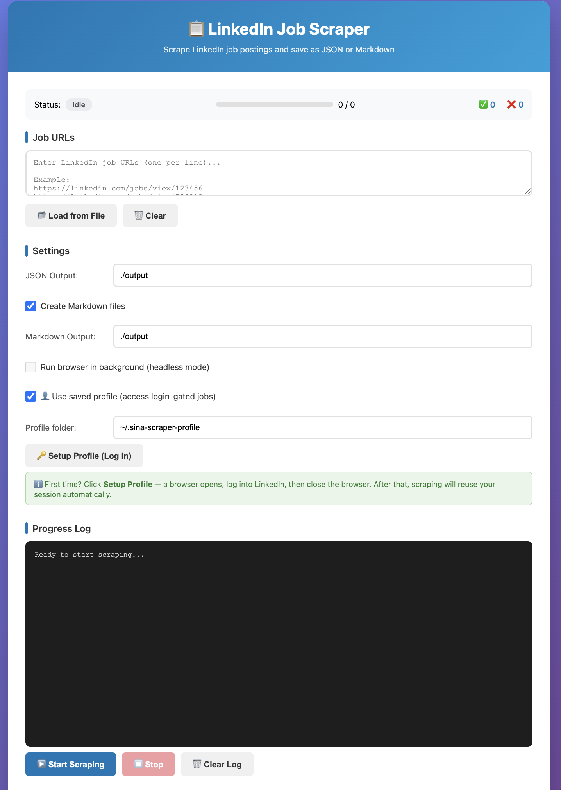

# Linkedin Job Scraper

A Python tool to scrape LinkedIn job postings from URL list and save them as JSON or Markdown files. 

- Web-based GUI and CLI
- Option to Scrape while logged in (saved profile session for login-gated jobs)
- Export to JSON format (all jobs in one file) or Markdown with YAML frontmatter (one file per job)



## Installation

```bash
# Clone the repository
git clone https://github.com/karaoglusina/sina-linkedin-scraper.git
cd sina-linkedin-scraper

# Create virtual environment
python -m venv venv
source venv/bin/activate  # On Windows: venv\Scripts\activate

# Install dependencies
pip install -r requirements.txt

# For Web GUI, also install Flask
pip install flask

# Install Playwright browsers (one-time)
playwright install chromium
```

## Usage

### Web-Based GUI

**Installation:**

```bash
# Install Flask (required for web GUI)
pip install flask
```

**Launch:**

```bash
python web_gui.py
```

Then open your browser to: `http://127.0.0.1:5001`

**Options:**

```bash
# Use a different port
python web_gui.py --port 8080

# Enable debug mode
python web_gui.py --debug
```

**Quick Start:**

1. Run `python web_gui.py`
2. Open browser to http://127.0.0.1:5001
3. Paste LinkedIn job URLs (one per line) or click "Load from File"
4. Configure output directories (default: `./output`)
5. Toggle "Create Markdown files" if you want `.md` output
6. Click "▶️ Start Scraping"
7. Watch real-time progress!

**Note:** Port 5001 is used by default to avoid conflicts with macOS AirPlay Receiver (which uses port 5000).

**Saved Profile (Scrape While Logged In):**

To access login-gated job postings, you can use a saved browser profile with your LinkedIn session:

1. In the web GUI, check "👤 Use saved profile"
2. Click "🔑 Setup Profile" — a browser window opens
3. Log into LinkedIn manually, then close the browser
4. Your session is saved and will be reused for all future scraping sessions

The profile is stored at `~/.sina-scraper-profile` by default. This allows the scraper to access jobs that require authentication.

### CLI Version

#### Single Job

```bash
# JSON only (saved to ./output/jobs.json)
python -m src.main "https://linkedin.com/jobs/view/..."

# JSON + Markdown
python -m src.main "https://linkedin.com/jobs/view/..." -m

# Custom Markdown directory (e.g., Obsidian vault)
python -m src.main "https://linkedin.com/jobs/view/..." -m --md-dir ~/Documents/Jobs
```

#### Batch Scraping

Create a file with URLs (one per line):

```
# jobs.txt - lines starting with # are ignored
https://linkedin.com/jobs/view/123456
https://linkedin.com/jobs/view/789012
https://linkedin.com/jobs/view/345678
```

Run batch scrape:

```bash
# Batch scrape with Markdown
python -m src.main --batch jobs.txt -m

# Batch with custom directories
python -m src.main --batch jobs.txt -m -o ./data --md-dir ~/Documents/Jobs
```

## CLI Options

| Option           | Description                   | Default      |
| ---------------- | ----------------------------- | ------------ |
| `url`            | Single LinkedIn job URL       | -            |
| `--batch FILE`   | File with URLs (one per line) | -            |
| `-m, --markdown` | Also create Markdown files    | Off          |
| `-o, --output`   | JSON output directory         | `./output`   |
| `--md-dir`       | Markdown output directory     | Same as `-o` |
| `--no-headless`  | Show browser window (debug)   | Off          |

## Output

### JSON (`output/jobs.json`)

All scraped jobs are saved to a single JSON file as an array:

```json
[
  {
    "id": "4335261686",
    "title": "AI Agent Engineer",
    "companyName": "Reavant",
    "location": "Amsterdam",
    "description": "...",
    ...
  }
]
```

### Markdown (`Title - Company.md`)

Each job gets its own Markdown file with YAML frontmatter:

```markdown
---
id: "4335261686"
title: "AI Agent Engineer"
companyName: "Reavant"
location: "Amsterdam"
...
---

**Job Description**

- Requirement 1
- Requirement 2
...
```

## Performance

| Mode                  | Time per job |
| --------------------- | ------------ |
| Single job            | ~2s          |
| Batch (browser reuse) | ~1s          |

## Extracted Fields

- Job ID, title, URL
- Company name, URL, ID
- Location
- Posted time & calculated publish date
- Number of applicants
- Full description (text + HTML)
- Contract type, experience level
- Job function, industry sector
- Apply type (Easy Apply / External)
- Poster name & profile URL

## Troubleshooting

**GUI Issues on macOS with Python 3.13+**

If you encounter tkinter compatibility errors (like "macOS 26 required"), use the web-based GUI instead. It works on all platforms without compatibility issues.

```bash
python web_gui.py
```

---